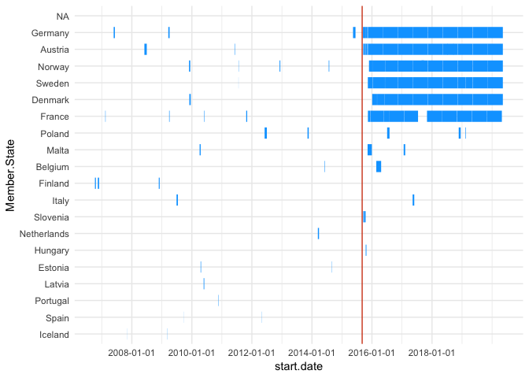
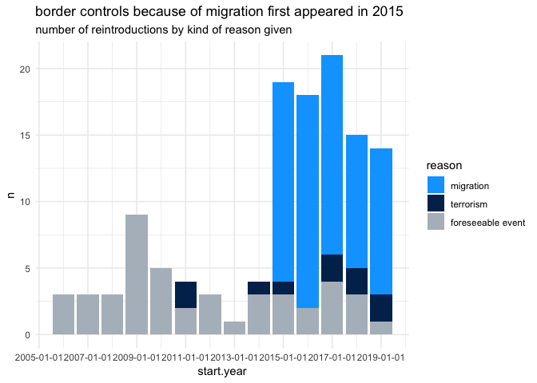
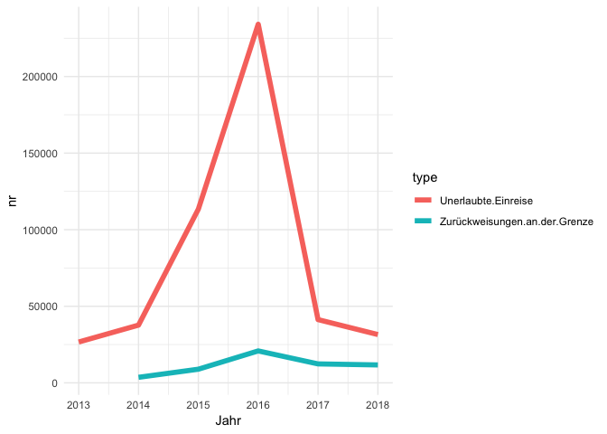
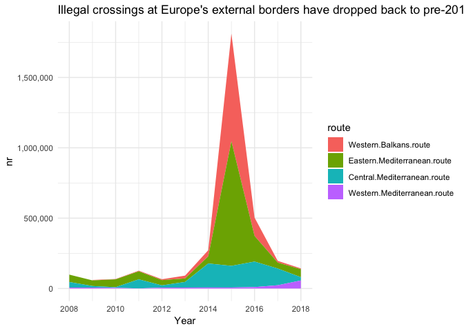

As large numbers of displaced people arrived in 2015, some Schengen countries reintroduced border checks. Six are extending controls. That's illegal, EU observers say, and it undermines the idea of freedom of movement.

*In this repository, you will find the methodology, data and code behind the story that came out of this analysis.*

**Read the full article on DW.com:** [English](https://www.dw.com/a-51033603) | [German](https://www.dw.com/a-51033606)

**Story by:** [Kira Schacht](https://twitter.com/daten_drang)

``` r
## install and load needs, if not yet present
# install.packages("needs")
library(needs)

# packages used in this markdown document
needs(tidyverse)
```

Read data
=========

The European Commission publishes a list of all notifications about temporary reintroductions of border controls by country and reason on their [Website](https://ec.europa.eu/home-affairs/sites/homeaffairs/files/what-we-do/policies/borders-and-visas/schengen/reintroduction-border-control/docs/ms_notifications_-_reintroduction_of_border_control_en.pdf).

We converted the list from the PDF to a spreadsheet with [Tabula](https://tabula.technology/). You can find the original PDF as downloaded on 11/11/2019 in the file `ms_notifications_-_reintroduction_of_border_control_en.pdf`. The processed CSV file is `bordercontrols.csv`.

``` r
#read data
d = read.csv("data/bordercontrols.csv", sep =";", stringsAsFactors = F, na.strings = "") %>% 
    mutate(start.date = as.Date(start.date, "%d.%m.%y"), end.date = as.Date(end.date, "%d.%m.%y"),
           start.year = start.date %>% lubridate::floor_date(unit="year"),
           days = end.date - start.date)
#order the states by total number of days with border controls for visualization
state_order = d %>% group_by(Member.State) %>%
    summarise(days = sum(days)) %>% arrange(days) %>% `$`(Member.State)
d$Member.State = factor(d$Member.State, levels = state_order)
```

Plot all border controls per country
====================================

Make a chart that marks every time span in which a country reintroduced temporary border controls.

``` r
#all border controls per country
ggplot(d, aes(x = start.date, xend = end.date, y = Member.State, yend = Member.State)) + 
    geom_vline(aes(xintercept = as.Date("2015-09-04")), color = "#d44820") +
    geom_segment(color = "#00a5ff", size = 5) +
    scale_x_date(breaks = as.Date(paste0(seq(2006,2019,2),"-01-01"))) +
    theme_minimal()
```

    ## Warning: Removed 11 rows containing missing values (geom_segment).



``` r
ggsave("bordercontrols_countries.svg", device = "svg", width = 160, height = 160, units="mm")
```

    ## Warning: Removed 11 rows containing missing values (geom_segment).

*FINDING:* Some countries have had border controls in place since 2015. This is unprecedented.

Analyze reasons for controls
============================

In the `bordercontrols` data file, we categorized each reintroduction by reason into one of these categories:

-   `demonstration`
-   `political conference`
-   `sports event`
-   `other foreseeable event`
-   `terrorism`
-   `migration`

For this analysis, we'll group everything except for *terrorism* and *migration* into the category of *foreseeable event*. Then we'll chart how often which reason has been used by Schengen member states over time.

``` r
#create summarized dataset: year, reason, number of reintroductions
tmp = d %>%
    mutate(reason = ifelse(reason %in% c("migration", "terrorism"), reason, "foreseeable event")) %>% 
    group_by(start.year, reason) %>%
    summarise(n = n()) %>% ungroup %>% 
    mutate(reason = factor(reason, levels = c("foreseeable event", "terrorism", "migration") %>% rev))
#grouped bar chart: number of reintroductions by reason over time
ggplot(tmp, aes(start.year, n, fill = reason)) + geom_col() + theme_minimal() +
    scale_fill_manual(values = c("#00a5ff", "#002d5a","#b2bcc5")) +
    scale_x_date(breaks= seq(2005, 2020, 2) %>% paste0(.,"-01-01") %>% as.Date()) +
    ggtitle("border controls because of migration first appeared in 2015", sub = "number of reintroductions by kind of reason given")
```

    ## Warning: Removed 1 rows containing missing values (position_stack).



``` r
ggsave("bordercontrols_reasons.svg", device = "svg", width = 240, height = 135, units="mm")
```

    ## Warning: Removed 1 rows containing missing values (position_stack).

*FINDING:* Border controls because of migration surged in 2015.

Migration data for background
=============================

Member states, Germany in this example, cite migration-related statistics as the reason for border controls. Among them are the number of unauthorized entries into the country and rejections at the border, as well as the irregular crossings at Europe's external borders. We analyzed how these numbers have developed over time.

Unauthorized migration into Germany
-----------------------------------

You can find the data on migration into Germany in the file `migrationdata.csv`. The numbers of unauthorized entries come from the [Police Crime Statistics](https://www.bka.de/EN/CurrentInformation/PoliceCrimeStatistics/policecrimestatistics_node.html) of the past years. The number of rejections at the border can be found in a [lawmaker inquiry](http://dipbt.bundestag.de/dip21/btd/19/030/1903049.pdf) ("Kleine Anfrage") to the German parliament.

``` r
#read data
mig = read.csv("data/migrationdata.csv", sep =";", stringsAsFactors = F, na.strings = "") %>%
    gather("type", "nr", 2:8) %>% filter(grepl("Einreise|Zurückw",type), Jahr >= 2013)
#plot line chart
ggplot(mig, aes(Jahr, nr, color = type)) + geom_line(size=2) + theme_minimal()
```

    ## Warning: Removed 1 rows containing missing values (geom_path).



``` r
ggsave("bordercontrols_migrationdata.svg", device = "svg", width = 240, height = 135, units="mm")
```

    ## Warning: Removed 1 rows containing missing values (geom_path).

*FINDING:* Figures have decreased to pre-2014 level.

Irregular crossings at Europe's external borders
------------------------------------------------

The file `externalborders.csv` contains [data from Frontex](https://frontex.europa.eu/along-eu-borders/migratory-routes/western-mediterranean-route/) on the number of irregular crossings at external EU borders by migration route.

``` r
#external borders
ext = read.csv("data/externalborders.csv", sep =";", na.strings = "") %>% select(-Summe) %>%
    gather("route", "nr", 2:6) %>% filter(!grepl("Land.borders", route)) %>% 
    mutate(route = factor(route,
           levels = c("Western.Mediterranean.route", "Central.Mediterranean.route", "Eastern.Mediterranean.route", "Western.Balkans.route") %>% rev))
#plot over time
ggplot(ext, aes(Year, nr, fill = route)) + geom_area() + theme_minimal() +
    scale_x_continuous(breaks = seq(2008,2020,2)) + scale_y_continuous(labels=function(x) format(x, big.mark = ",", scientific = FALSE)) +
    ggtitle("Illegal crossings at Europe's external borders have dropped back to pre-2014 levels")
```

    ## Warning: Removed 1 rows containing missing values (position_stack).



``` r
ggsave("bordercontrols_external.svg", device = "svg", width = 240, height = 135, units="mm")
```

    ## Warning: Removed 1 rows containing missing values (position_stack).

*FINDING:* Figures have decreased to pre-2014 level.
